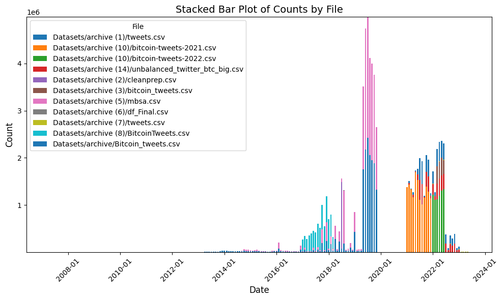
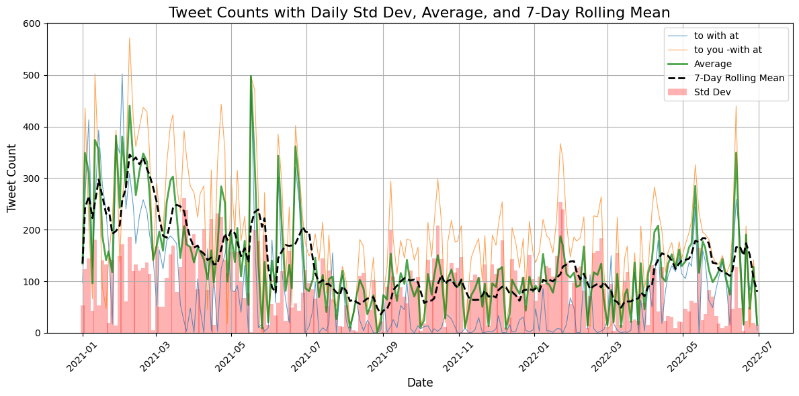
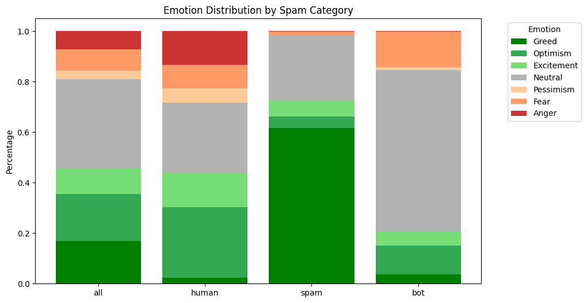
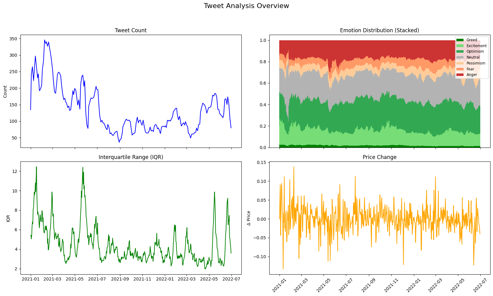
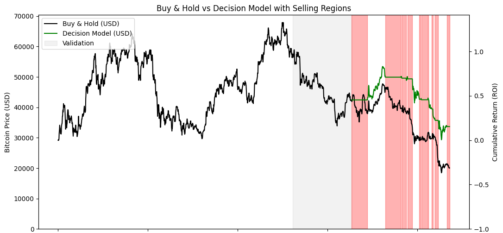
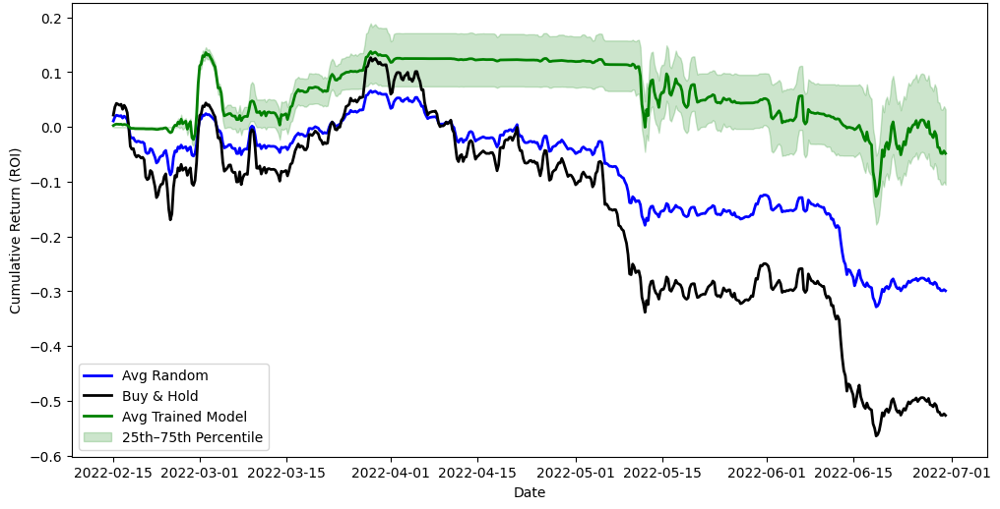

# Decision-Based Deep Learning for Bitcoin ROI Maximization  

## Overview  
This project explores how **deep learning and Natural Language Processing (NLP)** can improve financial decision-making in volatile markets. Instead of predicting Bitcoin prices directly, it introduces a **decision-based model** focused on **maximizing Return on Investment (ROI)**. The model leverages **emotion classification from Twitter data** to capture investor psychology and translate it into **Buy, Sell, or Hold** trading signals.  

---

## Data Collection & Scraping  
Since Twitter’s public API access was restricted, the project combined **public datasets** with a **custom scraping pipeline**.  
- Public datasets provided millions of historical tweets, with **Dataset 2 (2021–2022)** as the main source due to its scale and consistent coverage.  
- Additional scraping was implemented using headless browsers, rotating proxies, and query optimizations to bypass rate limits and avoid bans.  
- In total, the processed dataset contained **over 22M tweets** before filtering.  

---

## Search Queries & Zipf’s Law Estimation  
A key challenge was estimating the **daily tweet volume about Bitcoin**, since Twitter does not provide this directly.  
- Queries were designed with Twitter’s advanced search (e.g., keywords, date ranges, exclusions).  
- To reduce bias, queries were split using **neutral English words** (like *“the”*, *“with”*) with known frequencies.  
- Applying **Zipf’s Law**, the project estimated daily tweet counts by extrapolating from low-probability word queries.  
- This allowed scalable and cost-effective approximations of total daily activity, even when scraping only a subset.  

---

## Bot & Spam Detection + Emotion Classification  
### Training Dataset via Zero-Shot Labeling  
To create a labeled dataset efficiently, the **DeepSeek API** was used in a **zero-shot approach**:  
- Tweets were automatically classified as **human, bot, or spam**.  
- Human tweets were further labeled with one of **7 emotions**: *Fear, Greed, Optimism, Pessimism, Excitement, Anger, Neutral*.  
- This process labeled **100k tweets** at very low cost, producing a high-quality training dataset.  
### Fine-Tuned Models  
Using this labeled data, two **BERTweet-based models** were trained:  
- **Spam/Bot/Human Classifier** → achieved ~88% accuracy.  
- **Emotion Classifier** → classified across 7 emotions with ~65% accuracy (confusions mostly between similar emotions).  

Both models and datasets are publicly available on Hugging Face.  

---

## Features & Prediction Model  
The predictive model combines multiple sources of information:  
- **Twitter-derived signals**: daily emotion distributions (smoothed with rolling windows), tweet volume.  
- **Market signals**: Bitcoin historical price changes, volatility (IQR-based), and trend distributions.  

The decision model is built on an **LSTM architecture**:  
- Two LSTM layers (64 and 32 units) capture temporal dependencies.  
- Dropout & L2 regularization prevent overfitting.  
- Final output layer provides **Buy / Sell / Hold** recommendations, directly optimized for **ROI** instead of regression accuracy.  

---

## Results  
- The model consistently outperformed **Buy & Hold** and random baselines, especially in downtrending markets.  
- While Buy & Hold could lose ~50% in bearish periods, the decision model limited losses to around **–5%**.  
- Emotion classification proved more informative than binary sentiment, confirming that **investor psychology** carries predictive value.  

